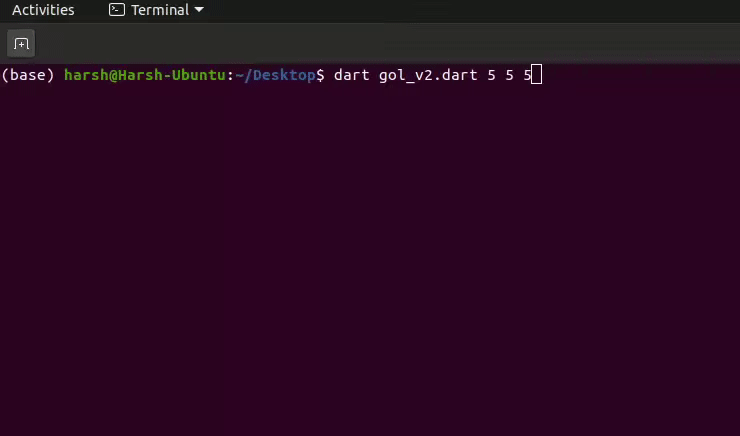

# Coding the famous Conway's Game-of-Life in Dart Language! 

# 1. Introduction
Conway's Game of Life is a cellular automaton game. It is a zero-player game, meaning that its evolution is determined by its initial state, requiring no further input.

## 2. Rules of Game
The game starts with a random initial population, which will further evolve on its own(requiring no further input) into new generation by following the rules mentioned below, and the process goes on either for infinity or becomes extinct after some generations.

     C   N                 new C
     1   0,1             ->  0  // Lonely
     1   4,5,6,7,8       ->  0  // Overcrowded
     1   2,3             ->  1  // Lives
     0   3               ->  1  // It takes three to give birth!
     0   0,1,2,4,5,6,7,8 ->  0  // Barren

## 3. Output of Code

## 4. Debugging
### 4.1 Guidelines
For debugging purposes,

1. Install Dart SDK as per above guidelines.
2. Clone this GitHub repo and navigate to the **Dart** directory.
3. You will find the buggy_gol_v2.dart file in it, which is the buggy implementation of Game of Life.
4. Make changes as per requirement or debug it and then run the file as per above **Usage** instructions.
5. If "Test Passed" is displayed at the end of the execution in Terminal/CMD, Congrats! you have successfully debugged this file. If not, please try again.

### 4.2 Debugging using online dart compiler
[Click here]([https://repl.it/@harshkachhadia/DartGameOfLife#main.dart](https://repl.it/@harshkachhadia/DartGameOfLife#main.dart)) to debug the buggy_gol_v4.dart file in the online compiler: 

### 4.3 Debugging using your own computer

#### 4.3.1 Installation
[Dart SDK Installation Guide](https://dart.dev/get-dart)

#### 4.3.2 Usage
After complete installation of Dart SDK,

Open terminal or command-prompt, navigate to the Dart directory and run the following command with proper arguements,
	
    $ dart <filename>.dart 
For eg.
    $ dart buggy_gol_v4.dart  
    (By default rows=5, columns=5, generations=5. If you want to change these values, you can change them inside the code. )

## 5. Sample Output

## 6. Making Contributions
Please ensure you are abiding by our Code of Conduct and Contribution guidelines when making contributions to this repository.

## 7. Contact
Contact me at this email for any queries:
Harsh Kachhadia - hmkachha@ncsu.edu