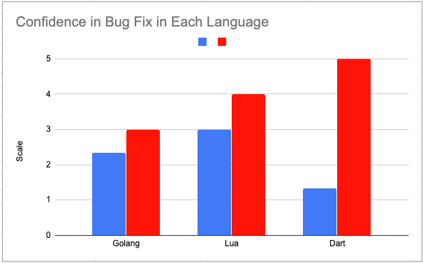

# Experiment Conclusions

Our data and visualizations can be seen at this [Google Sheet](https://docs.google.com/spreadsheets/d/1kz9Hj8m2nxQ8EtbHXal9YjH7S8xjFteBVq4-f7mumaY/edit?usp=sharing). Some visualizations and summaries are provided inline below.

## Methods

We studied 10 different participants across three different programming languages (Lua, Dart, and golang). Each particpant had 30 minutes to find bugs in a single implementation. We assigned each particpant a language to code in and observered their progress via Zoom screen sessions. In some cases we gave general hints, but stayed away from explicity mentioning where they were in the code. 

While we initially were expecting our participants to download our repository, we turned to [repl.it](https://repl.it) as our first experiments consumed too much time to download and setup their development environment.

## Materials

We utilized [repl.it](https://repl.it) to conduct our experiment. We used this online IDE for each participant. 

We utilized a [Google form](https://docs.google.com/forms/d/e/1FAIpQLSfKlXzNkoM31rRwZGDyyQHUqQ2LaqsOaHLS6QvlwOjfFOeHuQ/viewform) for capturing user feedback. The following responses were taken:
* Token Number?
* Language Worked on? 
 
  `golang`, `lua`, or `dart`

* On a scale of 1-5, how confident are you that you have fixed the bug, with 1 being the least confident and 5 being the most confident?"
* On a scale of 1-5, how easy do you find this language, with 1 being the easiest and 5 being the hardest?
* On a scale of 1-5, The easiness to understand the description and documentation of files with 1 being the easiest and 5 being the hardest?
* How long did it take you to fix the bug?
* Other Comments(text box for comments outside the above questions.)

We also had a shared Google Doc where each facilitator can writeup their observations from the Zoom screen sharing session. We also used this to note any common difficulties that would not be captured by our form.

## Observations

1. From the graph we see that the average ease of running a language was the highest for Dart followed by Lua and then Golang.
2. From the graph we see that the confidence of the user that a bug was fixed was the highest for Lua followed by Golang and then Dart.
3. From the graph we see that the people debugging the code found Dart to be easiest followed by Golang and then Lua.
4. Prior programming experience with a similar language aids a programmer in debugging an uncommon language with respect to language syntaxes and rules.
5. Debugging was comparatively easier for participants who had coded Game of Life in some other language familier to them.(makes thier logic clear)
6. Participants faced less difficulties in debugging codes that contained meaningful variable naming and comments all over the code.

## Conclusions

1. Even though the people debugging the code found Dart to be the easiest to understand, they were least confident in fixing the bugs.
2. Even though the people debugging the code found Lua to be the toughest to understand, they were most confident in fixing the bugs.
3. People debugging the code found Golang in between Lua and Dart in easiness to understand and in confidence of fixing the bug.
1. It is easy to learn a new language, if you have previously worked with some language following same programming paradigm.
2. Prior understanding of flow and logic of the program has proved out to be a necessary condition before starting code debugging.
3. Proper variable naming convention and documentation of code with comments aids an external person a lot, while debugging or understanding the code.

## Threats to Validity

Our threats to validity can be summarized in a few key points

* We did not ask for a pre-experiment survey to assert the participants experience with any of our langugages.

This could lead to participants saying they had not used a language, but in fact had. This would skew our results.

* We did not time the bugs very precisely. 

We relied on user feedback and our observations to identify that amount of time taken. This could also skew our results in the form of either bias, or simply forgetfullness. 

* Our sample size is small.

10 participants is very small for an experiment to draw meaningful conclusions from. 

## Learnings

We had a handful of learnings from conducting this experiment

- **Use pre-experiment survey to understand knowledge of participant with respect to any of our languages**

  Learning from the problems mentioned in "Threats to validity" section relating to this topic, we found that we can utilize pre-experiment tests to assess 2 things about the participant: 1. This will help us measure how participant's experience with a similar language aided the undrstanding of one of our languages 2. Measure how bug solving effort changes with prior experience of that participant in a similar language.

- **Use Tests to Help Participants Know They Have Fixed a Bug**

  Our participants had a hard time knowing if they had solved the bug. While we had tests in our repository, we should have written negative tests cases that were intentionally failing in a hosted coding environment like [repl.it](https://repl.it). This would have made it easier for participants to find logical errors in our implemenations. 

- **Start With a Hosted Coding Environment Like [repl.it](https://repl.it) First**

  If we would have used [repl.it](https://repl.it) to begin with, we could have made links to them, managing the bugs within them, etc. easier to manage.

- **Use Different Types of Bugs**

  We used only logical bugs instead of compilation bugs, mainly because we wanted our participants to use our repository. Something like [repl.it](https://repl.it) would have made this easier. 

- **We came across some new data collection tools that we can use for the final experiment**

1. Pre-experiment tests.
2. Comparing 3 languages based on how interesting the participant found this new language to learn.
3. Get input from the participant about how would they rate the difficulty level(either {easy, medium, hard} or a scale of 1-5) of bugs in our codes.
4. Get input from the user about what was the biggest hindrance that they faced while debugging the codes.  

